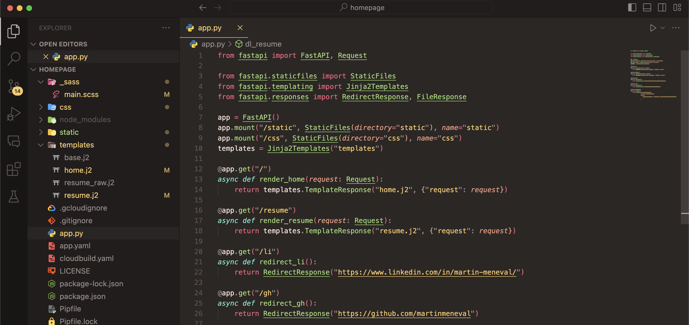
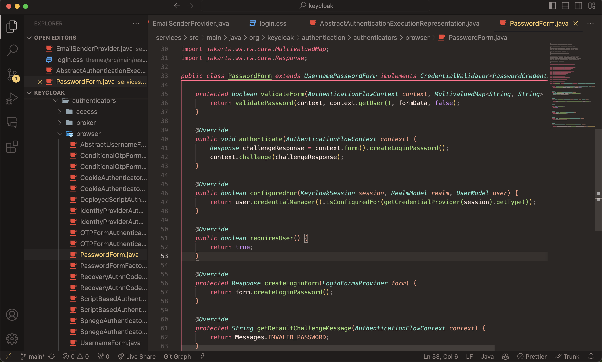

# M1okai

My take on a popular IDE color theme. Heavily inspired by the default Monokai theme and [Monokai Pro (Filter Ristretto)](https://marketplace.visualstudio.com/items?itemName=monokai.theme-monokai-pro-vscode), with a growing number of custom changes.

## Screenshots

### Python

### Java

## Building and installation

`vsce package` to create a .vsix file. Then install it from the command line with `code --install-extension m1okai-x.y.x.vsix`.

## Useful tools

- [Theme Color Reference](https://code.visualstudio.com/api/references/theme-color) - A list of all the colors that can be used in a theme.
- Command: Developer: Inspect Editor Tokens and Scopes - Shows the scope of the token under the cursor.
- Command: Developer: Toggle Developer Tools - Shows the HTML and CSS of the editor.

## Something amiss?

If you find any issues, please [report them](https://github.com/martinmeneval/m1okai/issues). Please make sure to include a screenshot of another theme doing what you expect, and a code sample for me to debug with. Thanks!
